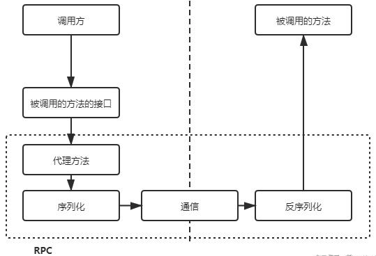

# grpc优点
1. 提供高效的进程间通信\
　　gRPC 没有使用 JSON 或 XML 这样的文本化格式，而是使用
一个基于 protocol buffers 的二进制协议与 gRPC 服务和客户端通
信。同时，gRPC 在 HTTP/2 之上实现了protocol buffers，从而能够
更快地处理进程间通信。
2. 支持多语言
3. 具有简单且定义良好的服务接口和模式\
　　gRPC 为应用程序开发提供了一种契约优先的方式。也就是
说，首先必须定义服务接口，然后才能去处理实现细节
4. 支持双工流\
　　gRPC 在客户端和服务器端都提供了对流的原生支持，这些功
能都被整合到了服务定义本身之中。因此，开发流服务或流客户端
变得非常容易。与传统的 RESTful 服务消息风格相比，gRPC 的关
键优势就是能够同时构建传统的请求–响应风格的消息以及客户端
流和服务器端流。

还有一些别的，但看不懂就没写上来，以上内容来自《gRPC与云原生应用开发：以Go和Java为例》
# 一些对于rpc的总结
rpc是远端过程调用，其调用协议通常包含：**传输协议** 和 **序列化协议**。
## 传输协议
grpc使用http2
## 序列化协议
例如基于文本编码的 json 协议；也有二进制编码的 **protobuf**、hession 等协议；还有针对 java 高性能、高吞吐量的 kryo 和 ftc 等序列化协议
## http与grpc
* http若使用http1.1协议作为传输协议：\
  通用定义的http1.1协议的tcp报文包含太多废信息。即使编码协议也就是 body 是使用二进制编码协议，报文元数据也就是header头的键值对却使用了文本编码，非常占字节数。
  ```html
    HTTP/1.0 200 OK 
    Content-Type: text/plain
    Content-Length: 137582
    Expires: Thu, 05 Dec 1997 16:00:00 GMT
    Last-Modified: Wed, 5 August 1996 15:55:28 GMT
    Server: Apache 0.84

    <html>
      <body>Hello World</body>
    </html>
    ```
* 关于rpc的两个简单图例\
HTTP 既可以和 RPC 一样作为服务间通信的解决方案，也可以作为 RPC 中通信层的传输协议（此时与之对比的是 TCP 协议）。

rpc的原理\

* grpc不能通过浏览器访问
# gRPC
## 调用模型

## 特点
1. 语言无关，支持多种语言；

2. 基于 IDL 文件定义服务，通过 proto3 工具生成指定语言的数据结构、服务端接口以及客户端 Stub；

3. 通信协议基于标准的 HTTP/2 设计，支持双向流、消息头压缩、单 TCP 的多路复用、服务端推送等特性，这些特性使得 gRPC 在移动端设备上更加省电和节省网络流量；

4. 序列化支持 PB（Protocol Buffer）和 JSON，PB 是一种语言无关的高性能序列化框架，基于 HTTP/2 + PB, 保障了 RPC 调用的高性能。