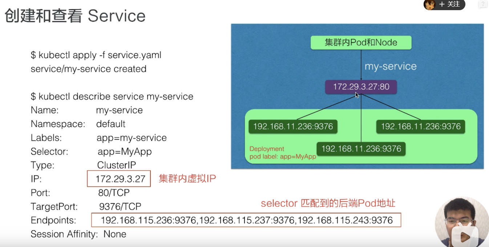
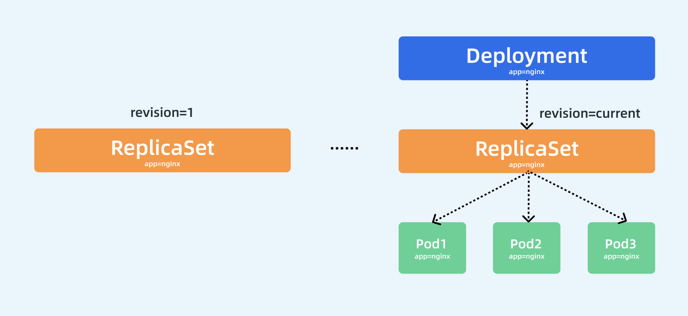
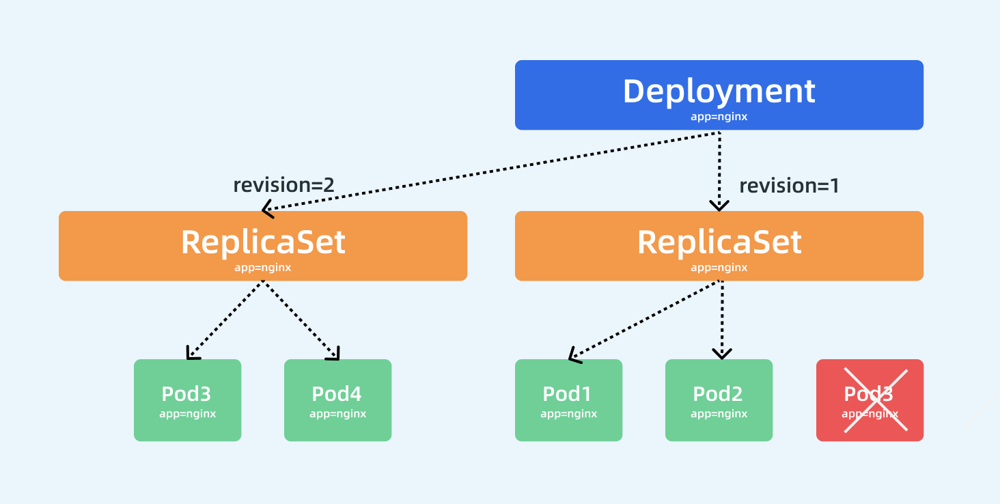
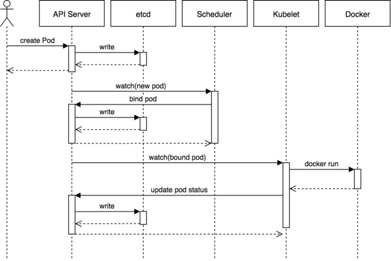

# Service
Service 是应用服务的抽象，通过 Labels 为应用提供**负载均衡和服务发现**。匹配 Labels 的 Pod IP 和端口列表组成 Endpoints，由 kube-proxy 负责将服务 IP 负载均衡到这些 Endpoints 上。(没有实现Service就没有Endpoint！)
## 现状
每个pod都有各自的ip。Pod 是非永久性资源。
Deployment 中，在同一时刻运行的 Pod 集合可能与稍后运行该应用程序的 Pod 集合不同。
## CluserIP
有选择算符，直接访问pod
```yaml
apiVersion: v1
kind: Service
metadata:
  name: my-service
spec:
  selector:
    app: MyApp
  ports:
    - protocol: TCP
      port: 80
      targetPort: 9376
```

## Nodeport
```yaml
apiVersion: v1
kind: Service
metadata:
  name: my-service
spec:
  type: NodePort
  selector:
    app: MyApp
  ports:
      # 默认情况下，为了方便起见，`targetPort` 被设置为与 `port` 字段相同的值。
    - port: 80
      targetPort: 80
      # 可选字段
      # 默认情况下，为了方便起见，Kubernetes 控制平面会从某个范围内分配一个端口号（默认：30000-32767）
      nodePort: 30007
```
* 每个 Service 都会自动分配一个 cluster IP（仅在集群内部可访问的虚拟地址）和 DNS 名，其他容器可以通过该地址或 DNS 来访问服务。这个 IP 地址与一个 Service 的生命周期绑定在一起，当 Service 存在的时候它也不会改变。
* targetPort：绑定的对应容器接收流量的端口；
* port：抽象的 Service 端口，可以使任何其它 Pod 访问该 Service 的端口（即在集群内访问）
* ClusterIP类型的Service仅能在集群内访问
* Service 能够通过 <NodeIP>:spec.ports[*].nodePort 和 spec.clusterIp:spec.ports[*].port 而对外可见
* 每创建一个 Service，kube-proxy 就会从 API Server 获取 Services 和 Endpoints 的配置信息，然后根据其配置信息在 Node 上启动一个 Proxy 的进程并监听相应的服务端口。
# Deployment（Pod模板之一）
## 动机
描述 Deployment 中的 目标状态，而 Deployment 控制器（Controller） 以受控速率更改实际状态， 使其变为期望状态。（包括状态属性和pod数量）
## 更新部署
当且仅当 Deployment 的 Pod 模板（即.spec.template）发生更改时，才会触发 Deployment 的推出，例如，如果模板的标签或容器映像已更新。其他更新，例如扩展部署，不会触发推出。
## 查看部署推出状态
```
kubectl rollout status deployment
```
## 部署会控制pod的数量
部署确保在更新时只有一定数量的 Pod 关闭。默认情况下，它确保至少 75% 的所需 Pod 数量已启动（最多 25% 不可用）。

部署还确保仅创建超过所需数量的 Pod 的特定数量的 Pod。默认情况下，它确保最多 125% 的所需 Pod 数量增加（最大激增 25%）。
## 获取部署的详细信息
```
kubectl describe deployments xxx
```
## Deployment、Pod、ReplicaSet的关系

Deployment 是通过管理 ReplicaSet 的数量和属性来实现水平扩展/收缩以及滚动更新两个功能的。
## 水平伸缩
```
$ kubectl scale deployment nginx-deploy --replicas=4
```
## 滚动更新
```yaml
spec:
  replicas: 3  
  selector:  
    matchLabels:
      app: nginx
  minReadySeconds: 5
  strategy:  
    type: RollingUpdate  # 指定更新策略：RollingUpdate和Recreate
    rollingUpdate:
      maxSurge: 1
      maxUnavailable: 1
```
* type:可以设置为Recreate和RollingUpdate两个值，Recreate表示全部重新创建，默认值就是RollingUpdate。
* maxSurge：表示升级过程中最多可以比原先设置多出的 Pod 数量
* maxUnavaible：表示升级过程中最多有多少个 Pod 处于无法提供服务的状态
* minReadySeconds：表示 Kubernetes 在等待设置的时间后才进行升级

查看滚动更新状态
```
$ kubectl rollout status deployment/nginx-deploy
```
暂停更新
```
$ kubectl rollout pause deployment/nginx-deploy
```
恢复更新
```
$ kubectl rollout resume deployment/nginx-deploy
```
查看历史版本
```
$ kubectl rollout history deployment nginx-deploy
```
回滚
```
$ kubectl rollout undo deployment nginx-deploy [--to-revision=1]
```
实际上滚动更新就是增加一个新version的pod后删除一个旧version的pod。(version与ReplicaSet一一对应)

滚动更新后旧的ReplicaSet是不删除的，这也是回滚版本的凭借
# Pod
Pod 的设计理念是支持多个容器在一个 Pod 中共享网络和文件系统
## 创建过程

(每次API Server都会写入etcd更新状态)
## 通信
在同一个 Pod 内，所有容器共享一个 IP 地址和端口空间，并且可以通过 localhost 发现对方。
## Pod阶段
```
kubectl explain pod.status
```
Pod 的状态定义在 PodStatus 对象中，其中有一个 phase 字段，下面是 phase 的可能取值:
* 挂起（Pending）：Pod 信息已经提交给了集群，但是还没有被调度器调度到合适的节点或者 Pod 里的镜像正在下载
* 运行中（Running）：该 Pod 已经绑定到了一个节点上，Pod 中所有的容器都已被创建。至少有一个容器正在运行，或者正处于启动或重启状态
* 成功（Succeeded）：Pod 中的所有容器都被成功终止，并且不会再重启
* 失败（Failed）：Pod 中的所有容器都已终止了，并且至少有一个容器是因为失败终止。也就是说，容器以非0状态退出或者被系统终止
* 未知（Unknown）：因为某些原因无法取得 Pod 的状态，通常是因为与 Pod 所在主机通信失败导致的

Pod 遵循一个预定义的生命周期，起始于 Pending 阶段，如果至少 其中有一个主要容器正常启动，则进入 Running，之后取决于 Pod 中是否有容器以 失败状态结束而进入 Succeeded 或者 Failed 阶段。
## Pod生命周期
Pod 会被创建、赋予一个唯一的 ID（UID）
Pod 不具备自愈能力，不会被重新调度
## 容器状态
* Waiting（等待）
* Running（运行中）
* Terminated（已终止）
## 重启策略
通过配置restartPolicy字段来设置 Pod 中所有容器的重启策略，其可能值为**Always，OnFailure 和 Never，默认值为 Always**。restartPolicy 仅指通过 kubelet 在同一节点上重新启动容器。通过 kubelet 重新启动的退出容器将以指数增加延迟（10s，20s，40s…）重新启动，上限为 5 分钟，并在成功执行 10 分钟后重置。

不同的控制器会匹配不同的重启策略。比如Deployment期望Pod按规约一直执行，所以只能是Always。
## 容器探针
### 探针类型
* 存活态探针livenessProbe：指示容器是否正在运行。如果存活态探测失败，则 kubelet 会杀死容器， 并且容器将根据其重启策略决定未来。如果容器不提供存活探针， 则默认状态为 Success。

* 就绪态探针readinessProbe：指示容器是否准备好为请求提供服务。如果就绪态探测失败，端点控制器将从与 Pod 匹配的所有服务的端点列表中删除该 Pod 的 IP 地址（即删除所有配对的Service中的对应的Endpoint）。 初始延迟之前的就绪态的状态值默认为 Failure。 如果容器不提供就绪态探针，则默认状态为 Success。

* 启动态探针startupProbe: 指示容器中的应用是否已经启动。如果提供了启动探针，则所有其他探针都会被禁用，直到此探针成功为止。如果启动探测失败，kubelet 将杀死容器，而容器依其重启策略进行重启。如果容器没有提供启动探测，则默认状态为 Success。
### 配置探针
在spec.containers中设置对应字段。

有三种配置方式：
1. exec：执行一段命令
2. http：检测某个 http 请求
3. tcpSocket：使用此配置，kubelet 将尝试在指定端口上打开容器的套接字。如果可以建立连接，容器被认为是健康的，如果不能就认为是失败的。实际上就是检查端口。
例子：
* 利用exec配置存活探针
```yaml
apiVersion: v1
kind: Pod
metadata:
  name: liveness-exec
spec:
  containers:
  - name: liveness
    image: busybox
    args:
    - /bin/sh
    - -c
    - touch /tmp/healthy; sleep 30; rm -rf /tmp/healthy; sleep 600
    livenessProbe:
      exec:
        command:
        - cat
        - /tmp/healthy
      initialDelaySeconds: 5 //第一次执行探针需要等待的时间
      periodSeconds: 5 //让kubelet每隔5秒执行一次探针
```
30s内pod是正常运行的，后面探针检测会Failure，执行重启。

https://hub.docker.com/layers/busybox/library/busybox/latest/images/sha256-c71cb4f7e8ececaffb34037c2637dc86820e4185100e18b4d02d613a9bd772af?context=explore
这是busybox的Dockerfile，根据CMD、ENTRYPOINT和args之间的关系看。

* 利用http配置存活探针
```yaml
apiVersion: v1
kind: Pod
metadata:
  name: liveness-http
spec:
  containers:
  - name: liveness
    image: cnych/liveness
    args:
    - /server
    livenessProbe:
      httpGet:
        path: /healthz
        port: 8080
        httpHeaders:
        - name: X-Custom-Header
          value: Awesome
      initialDelaySeconds: 3
      periodSeconds: 3
```
https://hub.docker.com/layers/cnych/liveness/latest/images/sha256-73a01b0be66ce72e7a6bcd46e67bd0b1fdd0b624581a472f0cc7dfb14afb1051?context=explore这是cnych/liveness

该探针将向容器中的 server 的 8080 端口发送一个 HTTP GET 请求。如果 server 的 /healthz 路径的 handler 返回一个成功的返回码，kubelet 就会认定该容器是活着的并且很健康，如果返回失败的返回码，kubelet 将杀掉该容器并重启它。
## 资源配额
* spec.containers[].resources.limits.cpu：CPU 上限值，可以短暂超过，容器也不会被停止
* spec.containers[].resources.requests.cpu：CPU请求值，Kubernetes 调度算法里的依据值，可以超过

如果你需要保证的你应用优先级很高，也就是资源吃紧的情况下最后再杀掉你的 Pod，那么你就把你的 requests 和 limits 的值设置成一致
# 端口转发
可以转发pod的端口(包括pod模板Deploymen)，和service

